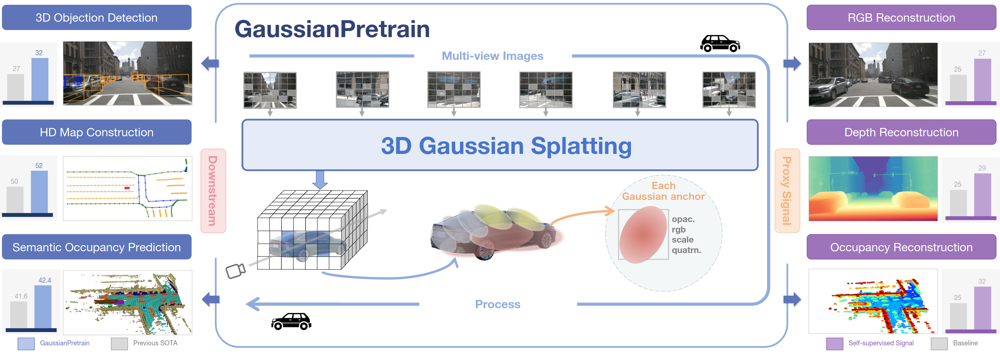
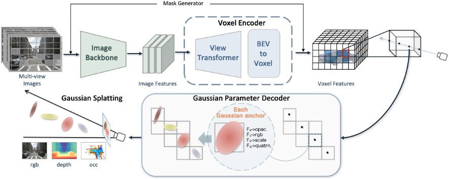

<div align='center'>

# GaussianPretrain: A Simple Unified 3D Gaussian Representation for Visual Pre-training in Autonomous Driving
### [Paper](https://arxiv.org/abs/2411.12452) | Project Page[TODO]

Shaoqing Xu<sup>1</sup>, Fang Li<sup>2</sup>, Shengyin Jiang<sup>3</sup>, Ziying Song<sup>4</sup>, Li Liu<sup>2</sup>, Zhi-xin Yang<sup>1*</sup>,
<br>

<sup>1</sup>University of Macau, <sup>2</sup>BIT, <sup>3</sup>BUPT, <sup>4</sup>BJTU‌

</div>

## Introduction

💥GussianPretrain introduces 3D Gaussian Splatting technology into vision pre-training task for the first time.
Which demonstrates remarkable effectiveness and robustness, achieving significant improvements
across various 3D perception tasks, including 3D object detection, HD map reconstruction, and occupancy prediction,
with efficiency and lower memory consumption.💥

<p align="center">
  
</p>

## News
- [2025-01-01] 💥 The experiments setting of **UVTR-CS** config and weight also released which not achieved in the paper.

- [2025-01-01] 🚀 The complete code and associated weights have been released. By the way, Happy New Year to everyone! 💥.

- [2024-11-20] The codebase is initialed. We are diligently preparing for a clean, optimized version. Stay tuned for the complete code release, which is coming soon.. 

- [2024-11-19] The paper is publicly available on [arXiv](https://arxiv.org/abs/2411.12452).


## Overview
💥The architecture of proposed GaussianPretrain. Given multi-view images, we first extract valid mask patches using the mask generator with the LiDAR Depth Guidance strategy. Subsequently, a set of learnable 3D Gaussian anchors is generated using ray-based guidance and conceptualized as volumetric LiDAR points. Finally, the reconstruction signals of RGB, Depth, and Occupancy are decoded based on the predicted Gaussian anchor parameters.
<p align="center">
  
</p>

### Weights
#### 1. Object Detection
| Method        | Pretrained ckpt | Config | NDS   | mAP  |  Model |
|---------------|-----|--------------|-------|------|--------
| **UVTR-C+GP** | [Pretrained](https://drive.google.com/file/d/1f3brSVve4i3UaFBRXODu0KOy9NCkWzjY/view?usp=drive_link)  |[**UVTR-C**](projects/configs/gaussianpretrain/gp_0.075_convnext.py) | 47.2  | 41.7 | [Google](https://drive.google.com/file/d/1EiyUJ6mAfCo6ASaeK5zhH0dhJtzQJcAu/view?usp=drive_link)
| **UVTR-C+GP** | [Pretrained](https://drive.google.com/file/d/1f3brSVve4i3UaFBRXODu0KOy9NCkWzjY/view?usp=drive_link)  |[**UVTR-CS**](projects/configs/gaussianpretrain/uvtr_dn_cs_ft.py) | 50.0 | 42.3 | [Google](https://drive.google.com/file/d/1eT1MrrZpBY1UBRa2NKz5mRkmbf0USvmW/view?usp=drive_link)
#### 2. HD-Map Reconstruction
| Method             | Pretrained ckpt | Config | mAP  |  Model 
|--------------------|----------------|--------|---------|--------
| **MapTR-tiny†+GP** | [Pretrained]() |[**MapTR-tiny**]()    | 42.42  | [Google]()
#### 3. Occupancy Predict
| Method | Pretrained ckpt                                                                                     |  Config | mIoU    |  Model |
|--------|-----------------------------------------------------------------------------------------------------|---------------|---------|----------------
|**BEVFormerOCC+GP**| [Pretrained](https://drive.google.com/file/d/1K8zQKeWfA1kzZEZfC-mPEuWKme5GJJsC/view?usp=drive_link) | [**BEVFormerOCC**](projects/configs/occ_pretrain_ft/bevformer_occ_ft.py)  | 24.21 | [Google](https://drive.google.com/file/d/1K5sZ9436qHp8ZrEtTBTu11B7s6KIfIiJ/view?usp=drive_link)
|**PanoOCC+GP**| [Pretrained](https://drive.google.com/file/d/1Y24shxyLvizZK3vhwGl2ApsPFjXzDWqR/view?usp=drive_link)    | [**PanoOCC**](projects/configs/occ_pretrain_ft/pano_occ_ft.py)   | 42.62 | [Google](https://drive.google.com/file/d/1SocYH0XEtU-STkXVFvfLSeNgRBQN8xXh/view?usp=drive_link)

## Getting Started
## Installation
This project is based on MMDetection3D, which can be constructed as follows.

- Install PyTorch [v1.9.1](https://pytorch.org/get-started/previous-versions/) and mmDetection3D [v0.17.3](https://github.com/open-mmlab/mmdetection3d/tree/v0.17.3) following the [instructions](https://github.com/open-mmlab/mmdetection3d/blob/v0.17.3/docs/getting_started.md).
- Install the required environment

```
conda create -n gaussianpretrain python=3.8
conda activate gaussianpretrain
conda install pytorch==1.9.1 torchvision==0.10.1 torchaudio==0.9.1 cudatoolkit=11.3 -c pytorch -c conda-forge

pip install mmcv-full==1.3.11 -f https://download.openmmlab.com/mmcv/dist/cu111/torch1.9/index.html
pip install mmdet==2.14.0 mmsegmentation==0.14.1 tifffile-2021.11.2 numpy==1.19.5 protobuf==3.19.4 scikit-image==0.19.2 pycocotools==2.0.0 nuscenes-devkit==1.0.5 spconv-cu111 gpustat numba scipy pandas matplotlib Cython shapely loguru tqdm future fire yacs jupyterlab scikit-image pybind11 tensorboardX tensorboard easydict pyyaml open3d addict pyquaternion awscli timm typing-extensions==4.7.1

cd GaussianPretrain
python setup.py develop
cd projects/mmdet3d_plugin/ops/diff-gaussian-rasterization
python setup.py develop
```
### Data Preparation
Please follow the instruction of [UVTR](https://github.com/dvlab-research/UVTR) and [PanoOCC](https://github.com/Robertwyq/PanoOcc) to prepare the dataset.

### Training & Testing
You can train and eval the model following the instructions. For example:
```
# run gaussian pretrain on 8 GPUS
bash tools/dist_train.sh projects/mmdet3d_plugin/configs/gaussianpretrain/gp_0.075_convnext.py 8

# run downstream task ft on 8 GPUS
bash tools/dist_train.sh projects/mmdet3d_plugin/configs/gaussianpretrain/uvtr_dn_ft.py 8

# run eval
python tools/test.py $config $ckpt --eval bbox
```
### Weights
#### 1. Object Detection
| Method        | Pretrained ckpt | Config | NDS   | mAP  |  Model |
|---------------|-----|--------------|-------|------|--------
| **UVTR-C+GP** | [Pretrained](https://drive.google.com/file/d/1f3brSVve4i3UaFBRXODu0KOy9NCkWzjY/view?usp=drive_link)  |[**UVTR-C**](projects/mmdet3d_plugin/configs/gaussianpretrain/gp_0.075_convnext.py) | 47.2  | 41.7 | [Google](https://drive.google.com/file/d/1EiyUJ6mAfCo6ASaeK5zhH0dhJtzQJcAu/view?usp=drive_link)
| **UVTR-C+GP** | [Pretrained](https://drive.google.com/file/d/1f3brSVve4i3UaFBRXODu0KOy9NCkWzjY/view?usp=drive_link)  |[**UVTR-CS**](projects/mmdet3d_plugin/configs/gaussianpretrain/uvtr_dn_cs_ft.py) | 50.0 | 42.3 | [Google](https://drive.google.com/file/d/1eT1MrrZpBY1UBRa2NKz5mRkmbf0USvmW/view?usp=drive_link)
#### 2. HD-Map Reconstruction
| Method             | Pretrained ckpt | Config | mAP  |  Model 
|--------------------|----------------|--------|---------|--------
| **MapTR-tiny†+GP** | [Pretrained]() |[**MapTR-tiny**]()    | 42.42  | [Google]()
#### 3. Occupancy Predict
| Method | Pretrained ckpt                                                                                     |  Config | mIoU    |  Model |
|--------|-----------------------------------------------------------------------------------------------------|---------------|---------|----------------
|**BEVFormerOCC+GP**| [Pretrained](https://drive.google.com/file/d/1K8zQKeWfA1kzZEZfC-mPEuWKme5GJJsC/view?usp=drive_link) | [**BEVFormerOCC**](projects/mmdet3d_plugin/configs/occ_pretrain_ft/bevformer_occ_ft.py)  | 24.21 | [Google](https://drive.google.com/file/d/1K5sZ9436qHp8ZrEtTBTu11B7s6KIfIiJ/view?usp=drive_link)
|**PanoOCC+GP**| [Pretrained](https://drive.google.com/file/d/1Y24shxyLvizZK3vhwGl2ApsPFjXzDWqR/view?usp=drive_link)    | [**PanoOCC**](projects/mmdet3d_plugin/configs/occ_pretrain_ft/pano_occ_ft.py)   | 42.62 | [Google](https://drive.google.com/file/d/1SocYH0XEtU-STkXVFvfLSeNgRBQN8xXh/view?usp=drive_link)

## TODO
* streampetr version will publish soon.
* Project Page.

## Citation
```
@article{xu2024gaussianpretrain,
  title={GaussianPretrain: A Simple Unified 3D Gaussian Representation for Visual Pre-training in Autonomous Driving},
  author={Xu, Shaoqing and Li, Fang and Jiang, Shengyin and Song, Ziying and Liu, Li and Yang, Zhi-xin},
  journal={arXiv preprint arXiv:2411.12452},
  year={2024}
}
```

## Acknowledgement
This project is mainly based on the following codebases. Thanks for their great works!
- [UVTR](https://github.com/dvlab-research/UVTR/tree/main)
- [UniPAD](https://github.com/Nightmare-n/UniPAD.git)
- [MMDetection3D](https://github.com/open-mmlab/mmdetection3d)